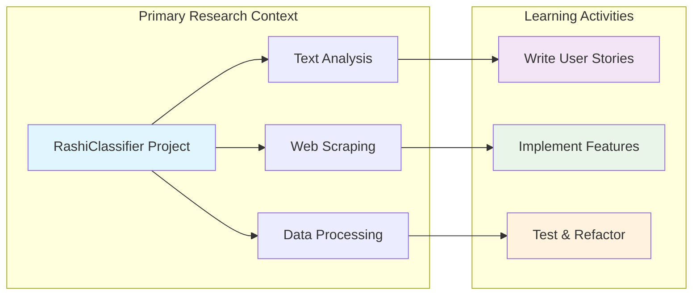
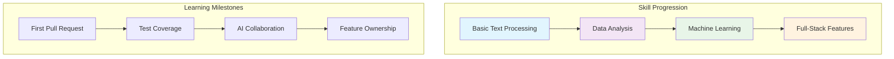

# Learning Objectives - Team Coding Exercises

## 1. Overview & Structure

### 1.1 Purpose & Scope

This repository primarily serves as a platform for analyzing Rashi's Sefer HaMitzvot (Book of Commandments). However, it also provides an excellent learning environment for beginner coders to practice essential team development skills. The RashiClassifier project offers a real-world context for learning modern software development practices, from writing tickets to implementing features using AI-first coding principles.

The project combines traditional Jewish text analysis with modern software development techniques, offering a unique platform for both research and learning collaborative development practices.

### 1.2 Learning Journey Flow

```mermaid
graph TB
    subgraph "Learning Path"
        A[Write Tickets] --> B[Open Pull Requests]
        B --> C[Implement TDD]
        C --> D[AI-First Coding]
        D --> E[Code Review]
        E --> F[Merge & Deploy]
    end
    
    subgraph "Skill Development"
        G[Git Workflow] --> H[Testing Practices]
        H --> I[AI Collaboration]
        I --> J[Team Communication]
    end
    
    style A fill:#e1f5fe
    style B fill:#f3e5f5
    style C fill:#e8f5e8
    style D fill:#fff3e0
    style E fill:#fce4ec
    style F fill:#f1f8e9
```

The learning journey follows a structured progression from basic version control to advanced AI-assisted development practices. Each step builds upon previous skills while contributing to the primary goal of Rashi analysis.

### 1.3 Project-Based Learning Structure

The project provides authentic context for learning, where students work on real features that contribute to a functional Rashi analysis system. This approach ensures that learning activities have genuine purpose and value for both research and skill development.

## 2. Core Learning Objectives

- **Git Workflow**: Branching, commits, pull requests, code reviews
- **TDD**: Red-Green-Refactor cycle with pytest
- **AI-First**: Effective prompting and AI code review
- **Team Communication**: User stories, feedback, documentation

## 3. Project Structure for Learning

### 3.1 Beginner-Friendly Entry Points

The RashiClassifier project offers multiple entry points for different skill levels:

- **Content Analysis**: Simple text processing tasks for Rashi's commentary
- **Data Visualization**: Creating charts and graphs of commandment relationships
- **Web Scraping**: Understanding data extraction from Wikisource
- **API Development**: Building interfaces for accessing Rashi's text data

### 3.2 Progressive Complexity

Students can start with simple tasks and gradually take on more complex features as their skills develop, all while contributing to meaningful Rashi research.

## 4. Assessment & Progress Tracking

**Learning Outcomes:**
- Write tickets, implement TDD, use AI assistants, contribute to code reviews

**Progress Indicators:**
- Successful pull requests, test coverage, code review quality, documentation