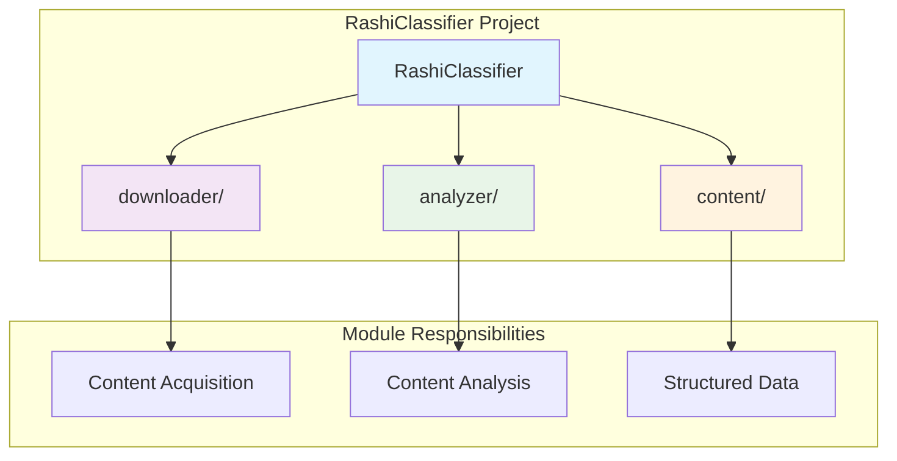
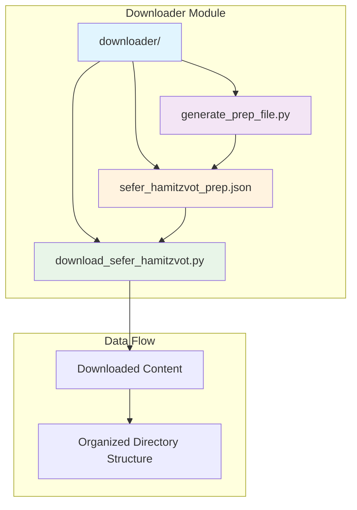

# RashiClassifier - Sefer HaMitzvot Web Scraper

[](https://www.python.org/downloads/)
[](LICENSE)
[]()

A Python-based web scraping tool designed to download and organize the complete Sefer HaMitzvot (Book of Commandments) by Rashi from the Hebrew Wikisource. The project systematically downloads all 613 commandments (248 positive and 365 negative) along with supporting content, organizing them into a structured local library for study and analysis.

## 🚀 Quick Start

### Prerequisites
```bash
pip install -r requirements.txt
```

### Installation & Usage
1. **Generate the preparation file:**
   ```bash
   cd downloader
   python generate_prep_file.py
   ```

2. **Download the content:**
   ```bash
   python download_sefer_hamitzvot.py
   ```

## 📋 Table of Contents

- [Features](#-features)
- [Project Structure](#-project-structure)
- [Installation](#-installation)
- [Usage](#-usage)
- [Configuration](#-configuration)
- [Technical Details](#-technical-details)
- [Use Cases](#-use-cases)
- [Contributing](#-contributing)
- [License](#-license)

## ✨ Features

- **Complete Coverage**: Downloads all 613 commandments plus supporting content
- **Multi-threaded**: Efficient parallel downloading with configurable concurrency
- **Recovery Mode**: Resume interrupted downloads without duplication
- **Content Cleaning**: Automatic removal of Wikisource navigation artifacts
- **Structured Output**: Organized directory hierarchy matching original structure
- **Progress Tracking**: Real-time download progress and statistics
- **Error Handling**: Robust error handling with detailed logging

## 📁 Project Structure

```
RashiClassifier/
├── downloader/                      # Download functionality module
│   ├── __init__.py                 # Package initialization
│   ├── download_sefer_hamitzvot.py # Main downloader script
│   ├── generate_prep_file.py       # URL generation and prep file creator
│   ├── sefer_hamitzvot_prep.json  # Generated URL and metadata file
│   └── README.md                   # Downloader documentation
├── analyzer/                        # Analysis functionality module (future)
│   ├── __init__.py                 # Package initialization
│   └── README.md                   # Analyzer documentation
├── requirements.txt                 # Python dependencies
├── README.md                        # This documentation
├── .gitignore                       # Git ignore patterns
└── content/                         # Downloaded content directory
    ├── index.txt                    # Complete file index
    ├── מצוות_עשה/                   # Positive commandments (248 files)
    ├── מצוות_לא_תעשה/               # Negative commandments (365 files)
    ├── שרשים/                       # Root principles (14 files)
    ├── הקדמה/                       # Introduction content
    ├── פתיחה/                       # Opening content
    ├── מקורות/                      # Sources and references
    └── קישורים_חיצוניים/           # External links
```

## 🔧 Installation

### Requirements
- Python 3.8 or higher
- Internet connection for downloading content

### Setup
1. Clone the repository:
   ```bash
   git clone https://github.com/yourusername/RashiClassifier.git
   cd RashiClassifier
   ```

2. Install dependencies:
   ```bash
   pip install -r requirements.txt
   ```

## 📖 Usage

### Basic Usage
The project operates in two phases:

1. **Preparation Phase**: Generate the URL and metadata file
2. **Download Phase**: Download and organize the content

### Step-by-Step Guide

1. **Generate Preparation File**
   ```bash
   cd downloader
   python generate_prep_file.py
   ```
   This creates `sefer_hamitzvot_prep.json` containing all target URLs.

2. **Download Content**
   ```bash
   python download_sefer_hamitzvot.py
   ```
   This downloads all content and organizes it into the `../content/` directory.

### Recovery Mode
If downloads are interrupted, you can resume:
```bash
python download_sefer_hamitzvot.py --recovery
```

## ⚙️ Configuration

### Download Settings
- **Concurrent Downloads**: Adjustable worker threads (default: 5)
- **Rate Limiting**: Built-in delays to respect server resources
- **Recovery Mode**: Skip existing files to resume interrupted downloads

### Customization
You can modify the following parameters in the scripts:
- `max_workers`: Number of concurrent download threads
- `delay`: Delay between requests (in seconds)
- `prep_file_path`: Path to the preparation file

## 🏗️ System Architecture

The RashiClassifier project consists of two main modules: the **downloader** module for content acquisition and the **analyzer** module for content analysis (future development).

### Overall Project Structure



### Downloader Module Architecture



## 🛠️ Technical Details

### Content Processing
- **Text Extraction**: Uses BeautifulSoup for HTML parsing
- **Content Cleaning**: Regex-based removal of navigation elements
- **Encoding**: UTF-8 Hebrew text preservation
- **File Organization**: Automatic directory creation and file categorization

### Performance
- **Concurrent Downloads**: Configurable thread pool (default: 5 workers)
- **Rate Limiting**: Built-in delays to prevent server overload
- **Memory Efficient**: Streaming downloads with minimal memory footprint
- **Resume Capability**: Skip existing files in recovery mode

### Dependencies
- `requests`: HTTP requests and session management
- `beautifulsoup4`: HTML parsing and content extraction
- `pathlib`: Cross-platform path handling
- `concurrent.futures`: Multi-threaded execution


## 🙏 Acknowledgments

- Hebrew Wikisource for hosting the Sefer HaMitzvot content
- Rashi (Rabbi Shlomo Yitzchaki) for the original work
- The open source community for the tools that made this project possible