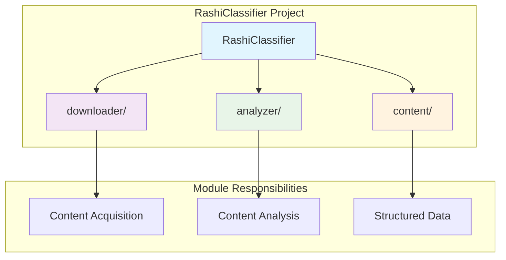
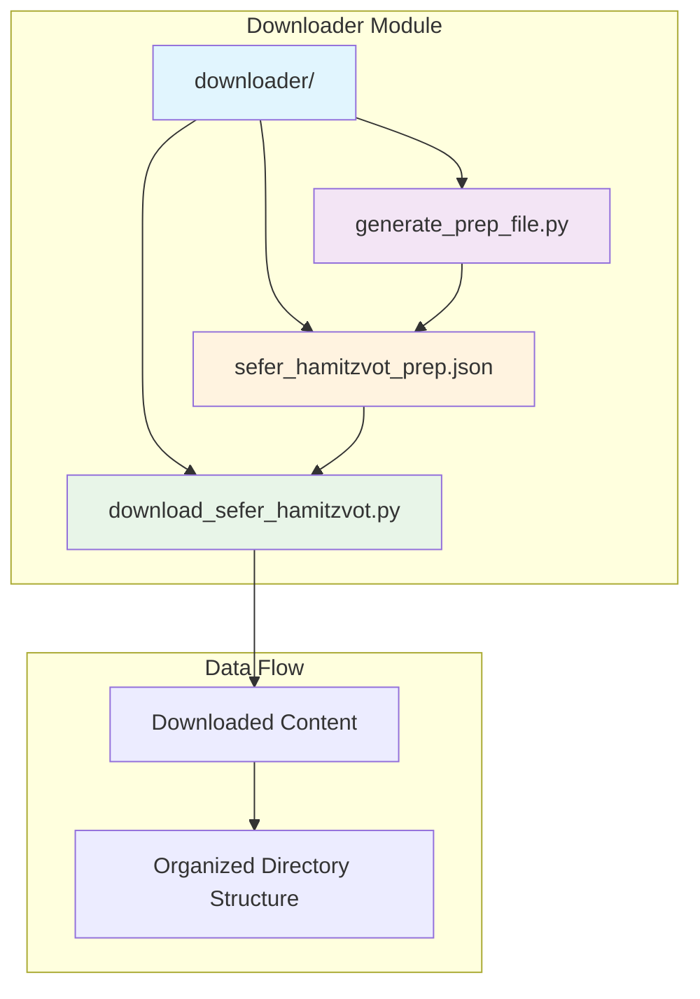
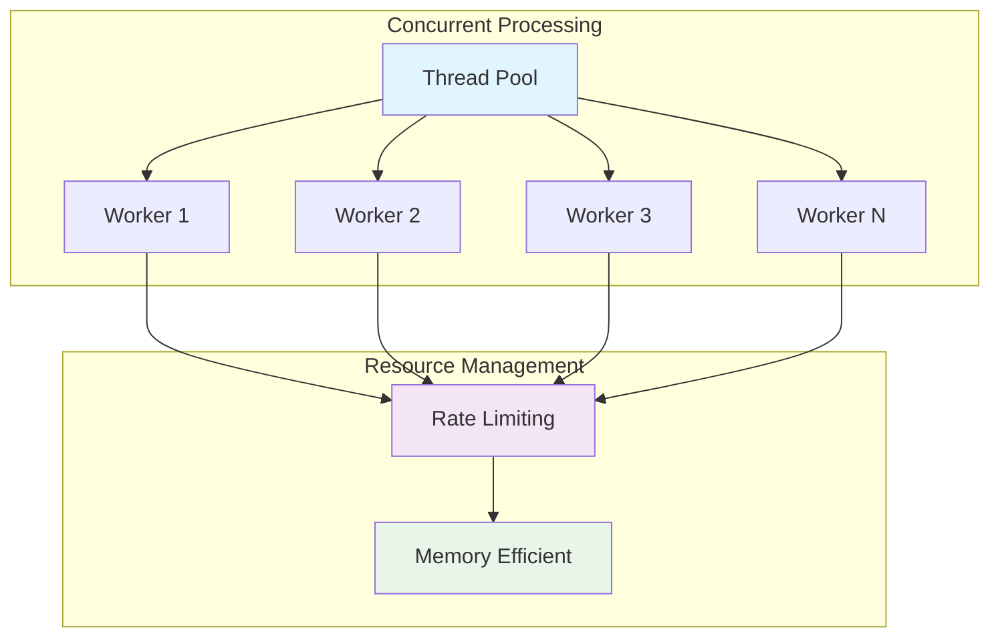

# Technical Documentation - RashiClassifier

## 1. Overview & Structure

### 1.1 Purpose & Scope

The RashiClassifier is a Python-based web scraping tool designed to download and organize the complete Sefer HaMitzvot (Book of Commandments) by Rashi from the Hebrew Wikisource. The system systematically downloads all 613 commandments (248 positive and 365 negative) along with supporting content, organizing them into a structured local library for study and analysis.

The project serves as both a functional tool for accessing Jewish religious texts and a learning platform for demonstrating web scraping, data organization, and content processing techniques.

### 1.2 System Architecture

The RashiClassifier project consists of two main modules: the **downloader** module for content acquisition and the **analyzer** module for content analysis (future development). The system follows a modular architecture where each component has distinct responsibilities, enabling clean separation of concerns and maintainable code structure.

### 1.3 Downloader Module Architecture

The downloader module implements a two-phase approach: preparation and execution. The preparation phase generates metadata and URL mappings, while the execution phase performs the actual content acquisition with robust error handling and recovery capabilities.

## 2. Technical Implementation

### 2.1 Content Processing Pipeline

The content processing pipeline handles the transformation of raw HTML content into clean, organized text files. The system uses BeautifulSoup for HTML parsing, implements regex-based cleaning for navigation artifacts, and maintains UTF-8 encoding for proper Hebrew text preservation.

### 2.2 Performance Optimization

The system implements concurrent downloads with configurable thread pools, built-in rate limiting to respect server resources, and memory-efficient streaming downloads. Recovery mode allows resuming interrupted downloads without duplication.

## 3. Project Structure

**Core Components:**
- `downloader/` - Content acquisition and processing
- `analyzer/` - Text analysis and research tools (future)
- `content/` - Organized Sefer HaMitzvot corpus with categorized commandments

**Key Files:**
- `requirements.txt` - Python dependencies
- `TECHNICAL_DOCUMENTATION.md` - Implementation details
- `LEARNING_OBJECTIVES.md` - Learning goals (secondary)

## 4. Configuration & Customization

### 4.1 Download Settings
- **Concurrent Downloads**: Adjustable worker threads (default: 5)
- **Rate Limiting**: Built-in delays to respect server resources
- **Recovery Mode**: Skip existing files to resume interrupted downloads

### 4.2 Customization Parameters
You can modify the following parameters in the scripts:
- `max_workers`: Number of concurrent download threads
- `delay`: Delay between requests (in seconds)
- `prep_file_path`: Path to the preparation file

## 5. Dependencies

### 5.1 Core Dependencies
- `requests`: HTTP requests and session management
- `beautifulsoup4`: HTML parsing and content extraction
- `pathlib`: Cross-platform path handling
- `concurrent.futures`: Multi-threaded execution

### 5.2 System Requirements
- Python 3.8 or higher
- Internet connection for downloading content

## 6. Use Cases

### 6.1 Primary Use Cases
- **Academic Research**: Access to complete Sefer HaMitzvot for study and analysis
- **Text Mining**: Structured data for natural language processing projects
- **Educational Content**: Local access to religious texts for educational purposes
- **Data Analysis**: Clean, organized dataset for statistical analysis

### 6.2 Technical Learning
- **Web Scraping**: Demonstrates robust web scraping techniques
- **Concurrent Programming**: Shows multi-threaded download implementation
- **Data Organization**: Illustrates structured file organization
- **Error Handling**: Exemplifies robust error handling and recovery

## 7. Acknowledgments

- Hebrew Wikisource for hosting the Sefer HaMitzvot content
- Rashi (Rabbi Shlomo Yitzchaki) for the original work
- The open source community for the tools that made this project possible 